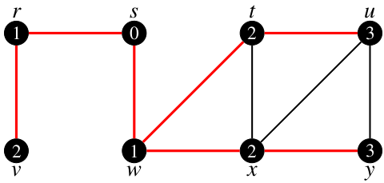
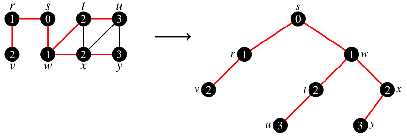

# breadth-first search

 
 
 
 

 

 

Na teoria dos grafos, a busca em largura, do inglês <i>breadth-first search (BFS)</i>, é o algoritmo que percorre o grafo utilizando-se movimentações em forma de <b>ondas</b>. O modelo de ondas se refere a forma de propagação da busca. Nela, os vértices são investigados visitando-se todos os seus adjacentes (i.e., vizinhos) para só depois um novo vértice ser escolhido e assim repetir o processo. Essas escolha é realizada no conjunto de vértices já conhecidos, ou seja, já visitados porém ainda não explorados. A ordem de escolha é definida pela ordem de descoberta.

Ao executar o BFS, os vértices de um grafo são enumerados de acordo com o momento em que se tornam conhecidos. Esse valor, aplicado aos vértices, indica o número de passos e/ou distância deste para um dado $v_0$, o vértice de inicialização. A Fig 1 detalha um pequeno exemplo da representação de distância acima citada.   

   
  <caption>Fig 1. Pequeno exemplo do resultado da execução do BFS em um grafo aleatório.</caption>

Conforme observado na Fig 1, o algoritmo tem sua inicialização no vértice $S$, o qual possui como vizinhos os vértices $R$ e $W$, os quais recebem valor de distância 1. Como tais vértices são os únicos conhecidos, um é escolhido para reaplicar o processo, o que atribui ao termino distância 2 para $V$, $T$ e $X$. Tal varredura e atribuição de distâncias é realizada até que não reste mais vértices a serem investigados.   

Observe pela Fig 1, que algumas arestas são desconsideradas durante a execução (i.e., arestas não vermelhas). Essas são descartadas porque levam, durante o processo de execução, à vértices já conhecidos. Como o algoritmo desconsidera qualquer caminho que tenha nele vértices conhecidos, essas arestas são invalidadas como parte do caminho obtido. O resultado desse processo produz uma <i>árvore primeiro na extensão</i> com raiz no vértice de partida. A Fig 2 detalha a árvore obtida do processo BFS aplicado ao grafo da Fig 1.

   
  <caption>Fig 2. Árvore primeiro na extensão obtida do processo BFS sob o grafo da Fig 1.</caption>

>
> **Notação**: Para cada vértice $v$, acessível a partir de $s$, o caminho na árvore primeiro na extensão de $s$ a $v$ corresponde ao <i>caminho mais curto</i> de $s$ a $v$, ou seja, um caminho que contém um número mínimo de arestas.
>

O processo de avaliação do BFS, conforme apresentado, está associado a diferentes algortímos classicos em computação. Dentre os mais conhecidos tem-se:

>
> 1. Algoritmo de menor caminho de Dijkstra: Utilizado para calcular rotas de custo mínimo a partir de um par de vérticies em que $(v_0 \neq v_n)$ e;
> 2. Algoritmo da árvore geradora mínima de Prim: Utilizado para interligar localidades a um custo mínimo para cada par de vértices adjacêntes de um grafo.
>

# O modelo de execução

Conforme pode-se observar, o BFS atua no grafo identificando vizinhança em um processo por largura. Nesse processo, vértices são dados como conhecidos e arestas são eliminadas, caso essas estejam conectadas a tais vértices. Para compreender esse processo, considere um modelo de coloração do grafo que classifica seus vértices como segue.

>
> 1. **vértice branco**: vértice não visitado e não conhecido.
> 2. **vértice cinza**: vértice conhecido mas não visitado. Seus adjacentes não foram inseridos ainda na fila.
> 3. **vértice preto**: vértice conhecido e visitado. Todos os seus adjacentes foram inseridos em uma fila e todos já são conhecidos. 
>

Considerando o padrão de cores acima citada, sempre que um vértice $v$ é descoberto no curso de varredura do grafo, o vértice $v$ e a aresta $(u,v)$ são adicionados na árvore primeiro na extensão. Nesse contexto, dizemos que $u$ é predecessor ou pai de $v$ na árvore.

Para projetar a ideia acima apresentada sob um código é preciso estabelecer variáveis auxiliares que consigam gerenciar o sistema de cores, bem como, os predecessores e número de saltos. Para tanto, considere como variáveis de apoio: 

>
> **cor[u]**: vetor utilizado para indicar os vértices atingíveis.
> 
> **$\pi$[u]**: indica o vértice predecessor do vértice $u$.
>
> **d[u]**: Indicativo de distância desde a origem. Atua para reportar o número de saltos de $v_0$ até o vértice $u$. 
>
> **Q**: Utilizado como fila para armazenar temporariamente os vértices conhecidos. Sua estrutra é pensada para condicionar tais vértices sob uma política FIFO de observação. 
>

Dado as definições de auxiliares acima descritas, tem-se como algoritmo de execução o BFS a seguinte sequência lógica (Fig 3):

   
  <caption>Fig 3. Algoritmo representativo da estratégia BFS.</caption>

# Compilação e Execução

A estrutura de grafo disponibilizada possui um arquivo Makefile que realiza todo o procedimento de compilação e execução. Para tanto, temos as seguintes diretrizes de execução:

| Comando                |  Função                                                                                           |                     
| -----------------------| ------------------------------------------------------------------------------------------------- |
|  `make clean`          | Apaga a última compilação realizada contida na pasta build                                        |
|  `make`                | Executa a compilação do programa utilizando o gcc, e o resultado vai para a pasta build           |
|  `make run`            | Executa o programa da pasta build após a realização da compilação                                 |

# Referências

[1] Thomas H. Cormen, Charles E. Leiserson, Ronald L. Rivest, Clifford Stein. Algoritmos:  Teoria e Prática. 3a edição. Elsevier, 2012. ISBN 9788535236996

# Contatos

 

<a style="color:black" href="mailto:michel@cefetmg.br?subject=[GitHub]%20Source%20Dynamic%20Lists">
✉️ <i>michel@cefetmg.br</i>
</a>

